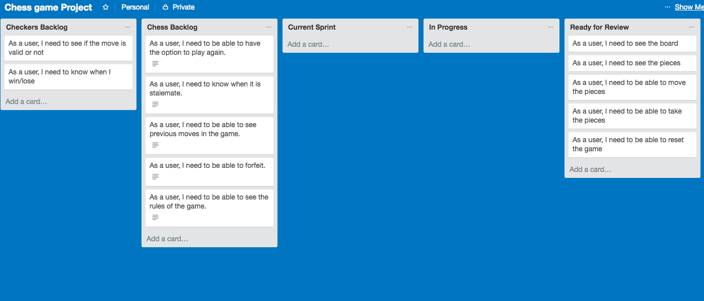

# *The Game*
1. The games I made are Chess and Checkers
2. Classic games that have been played for a long time, where a lot of logic is involved.
3. Will need to click on the links that will be added in the near future

# *Your Task*
1. Your task:
  *Your mission, should you choose to accept it! Is to build a **browser based game!** Your game should be built using html, css and JavaScript!

  **The choice of game is totally up to you however before you get to work, you must ensure you have had your project idea approved by one of your trainers.**

Your game must:

  * Include an instruction section explaining how to play the game.
  * Ether display a message when the user has won or display the users score after the game has finished.
  * Be styled to perfection!
  * Be hosted online!

**BONUS**

  * Your game could include a leaderboard.
  * Your game could be 2 player.
  * Your game could be played against the computer...
  * You could include some fancy animations in your game...
  * You could into HTML5 Audio and include some snazzy sound effects...

1. List of things your delivered (Completed user stories):
  * Chess:
    1. As a user, I need to be able to see the board
    2. As a user, I need to be able to see the pieces
    3. As a user, I need to be able to move the pieces
    4. As a user, I need to be able to take the opponents pieces
    5. As a user, I need to be able to forfeit
    6. As a user, I need to be able to reset
  * Checkers:
    1. As a user, I need to be able to see the board
    2. As a user, I need to be able to see the pieces
    3. As a user, I need to be able to move the pieces
    4. As a user, I need to be able to take the opponents pieces
    5. As a user, I need to be able to forfeit
    6. As a user, I need to be able to reset
3. What were you most pleased with:
  * I am pleased at how quickly I can now do the html and css of the page.
  * Rather than pleased, I am glad that I chose to code such difficult games. This is because I was able to expand my knowledge and way of thinking in terms of logically coding the game.
4. What was the most challenging part:
  * Everything
  * With chess, it was logically hard to think of all the ways to code the rules. Lots of problems would pop up along the way that could be integrated with the function I was coding.
  * With checkers, the way I named the variables got very confusing in the later stages, where there were too many "pieces".

*Planning*

